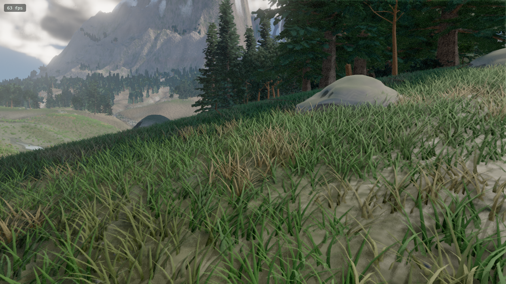
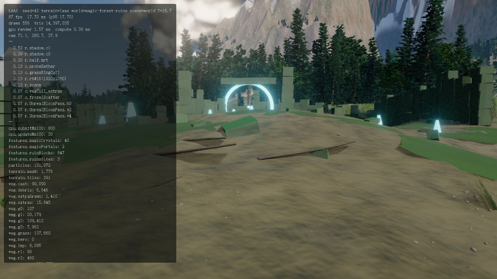
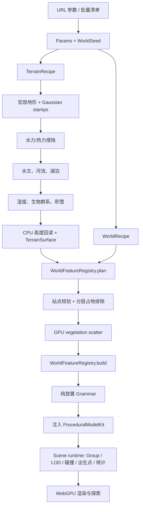

# Codex World Factory

Codex World Factory 是一个运行在浏览器中的程序化奇幻世界工厂。它以
three.js `WebGPURenderer`、TSL 和原生 WGSL compute 为基础，通过可复现的
`seed`，组合地形配方、生态系统和独立的世界内容库，生成可探索的 4×4 km
开放世界。

项目当前重点不是制作单个固定关卡，而是建立一套可以持续扩展的生成框架：
后续扩展建筑风格、道路、村庄、城堡、地下城入口和任务地标时，不需要重写
地形、植被或已有内容库。

> 当前版本：严格 TypeScript、WebGPU only、无 WebGL fallback。相同的
> `seed + terrain + world` 会生成相同的世界布局。

## 已有场景

### 程序化荒野 `wilderness`

基础地形、水文、生态、光照、大气、水体和探索系统，不叠加人工遗迹。



```text
http://localhost:5173/?world=wilderness&terrain=laas&seed=42&preset=low
```

### 魔法森林遗迹 `magic-forest-ruins`

在基础世界上规划并生成外环圣所、破败瞭望环和森林神龛，包含石墙、石柱、
碎石、水晶、传送门、地衣、植被避让、自动出生点、LOD 和碰撞。



```text
http://localhost:5173/?world=magic-forest-ruins&terrain=laas&seed=42&preset=low
```

一次验证样例（`seed=42`、`terrain=laas`）生成 3 个遗迹点、847 块程序化
石材、40 根魔法水晶和 2 个传送门。具体数量由配方和 seed 决定。

### 程序化奇幻城市 `fantasy-city`

在干燥、低坡度、低起伏的地形上选址，生成一个石基、灰泥墙和木构框架组成的
商贸街区。当前配方包含中心公会大厅、住宅、塔楼、暖色窗户和木门，并提前输出
植被清除区、城市入口、出生点、建筑碰撞边界、LOD 与运行时统计。

```text
http://localhost:5173/?world=fantasy-city&terrain=laas&seed=84&preset=low
```

默认 `fantasy-quarter` 配方以一个 3×3 街区骨架为目标：中心 1 栋公会大厅，
外围最多 32 栋确定性住宅或塔楼。楼层、尺寸、朝向、立面色板和塔楼分布由独立
seed stream 决定；极端山地或涉水地块会被跳过，让城市降级生成而不是启动失败。

## 世界生成逻辑

世界由三个相互独立的输入维度组合：

```text
World = Seed × TerrainRecipe × WorldRecipe
```

- `seed`：控制可复现的伪随机变化。
- `terrain`：控制山脉、裂谷、火山口等宏观地貌。
- `world`：控制遗迹、建筑、道路等地形之上的内容组合。

完整启动链如下：



### 1. 参数和命名随机流

`src/core/Params.ts` 解析 URL；`src/core/Seed.ts` 从主 seed 派生具有语义名称的
随机流。例如：

```text
terrain-recipe/folded-ranges/north-fold
feature/magic-forest-ruins/ancient-grove/site-0
```

模块不能共享一个不断前进的全局 RNG。新增建筑库或道路库时，不应导致已有
遗迹、树木或山脉整体换位。

### 2. 基础地形

`Heightfield.generate()` 根据 `TerrainRecipe` 建立高度场：

1. 原始宏观地形提供山体、峡谷、喀斯特区和湖盆骨架。
2. 各向异性 Gaussian stamps 叠加可编辑的山脉、裂谷或火山口形态。
3. 水力与热力侵蚀改变坡面、沉积和沟谷。
4. 水文系统计算流向、河道、湖泊和出水口。
5. 湿度、坡度、海拔和暴露度共同形成生物群系与积雪。
6. CDLOD 地形瓦片和远景壳体负责最终渲染。

Gaussian 配方只改变宏观地貌和硬度，不绕过侵蚀、水文、植被和渲染主流程。

### 3. 地形只读接口

地形完成后，`HeightfieldTerrainSurface` 将具体高度场转换为精简的
`TerrainSurface`：

```ts
interface TerrainSurface {
  heightAt(x: number, z: number): number;
  waterAt(x: number, z: number): number;
  slopeAt(x: number, z: number, step?: number): number;
  reliefAt(x: number, z: number, radius: number, samples?: number): number;
}
```

内容库只能依赖这个接口，不能直接依赖 renderer、具体 `Heightfield` 或 GPU
buffer。这样相同的遗迹规划器未来可以运行在不同地形实现上。

### 4. 内容规划先于植被散布

`WorldFeatureRegistry.plan()` 在树木、草地和石头散布之前执行。每个内容库会：

1. 根据地形高度、水面、坡度、起伏、海拔和间距选择站点。
2. 生成完整的 typed plan。
3. 输出树木、understory、extras 和 stones 各自的排除半径。

GPU clustered-Poisson scatter 和跟随相机的 `GroundRing` 都消费同一份排除
数据，因此不会出现树木穿墙、草地重新长进入口或石头堵住传送门的问题。

### 5. 纯放置语法与模型包

以魔法遗迹为例：

- `MagicForestRuinsGrammar` 只输出石块、水晶、传送门和碰撞线段的普通数据。
- `MagicRuinsModelKit` 只负责几何、材质和实例化，不知道什么是“圣所”。
- `MagicForestRuinsSceneGenerator` 将放置数据交给注入的模型包，并组装场景。
- `MagicForestRuinsLibrary` 是组合根，将 planner、grammar 和 model kit 连接起来。

因此可以替换低模、写实、不同文明或导入资产版本的模型包，而不修改选址和
布局算法。

### 6. 运行时

世界内容主要在启动阶段生成。进入逐帧阶段后，遗迹运行时只更新距离 LOD、
可见性和必要的动态效果，不重新选址、不重新执行 grammar，也不逐实例在 CPU
上更新大规模植被。

## 当前已有模块

### 地形配方

| ID | 作用 |
|---|---|
| `laas` | 原始宏观地形，作为回归基准。 |
| `folded-ranges` | 三条错位的长山褶皱与庇护谷地。 |
| `rift-valley` | 对角裂谷、低谷底和两侧硬质山肩。 |
| `caldera-lake` | 嵌套 Gaussian 火山口、内部湖盆和西南缺口。 |
| `rolling-lowlands` | 长缓坡、浅洼地和适合森林/农田的低地。 |
| `basin-country` | 被不对称高地环绕的开阔盆地。 |
| `desert-mesas` | 干旱平原上的硬质台地与孤峰。 |
| `glacial-uplands` | 高地肩部、冰川槽谷和雪地构图。 |

### 顶层世界配方

| ID | 环境与内容 |
|---|---|
| `wilderness` | 纯地形、水文和生态；未知 `world` 参数的安全回退。 |
| `magic-forest-ruins` | 古树林遗迹库，默认黄昏环境和较低风力。 |
| `fantasy-city` | 石木商贸街区，目标 33 栋建筑，包含地形降级、碰撞、LOD 和专属环境。 |

### 魔法遗迹模型目录

| Model ID | 分类 | 实例化 |
|---|---|---|
| `magic-ruins/aged-stone-block` | structure | 是 |
| `magic-ruins/crystal-spire` | prop | 是 |
| `magic-ruins/portal-ring` | effect | 否 |
| `magic-ruins/lichen-colony` | ground-cover | 否 |

### 城市建筑模型目录

| Model ID | 分类 | 实例化 |
|---|---|---|
| `city-buildings/stone-foundation` | structure | 是 |
| `city-buildings/plaster-shell` | structure | 是 |
| `city-buildings/steep-roof` | structure | 是 |
| `city-buildings/timber-frame` | structure | 是 |
| `city-buildings/lit-window` | prop | 是 |
| `city-buildings/wooden-door` | prop | 是 |

### 引擎与世界系统

| 模块 | 当前能力 |
|---|---|
| Terrain | 高度场、Gaussian stamps、侵蚀、水文、河流、湖泊、生物群系、积雪、CDLOD。 |
| Vegetation | 8 类树木、程序化枝干与树冠、3 类灌木、蕨类、3 类花、倒木、草地和地面碎屑。 |
| GPU scatter | clustered-Poisson 分布、分层排除、GPU culling、间接绘制和 LOD ring。 |
| Lighting | 四级 CSM、PCSS、接触阴影、terrain-relative irradiance probes、GTAO。 |
| Atmosphere | Hillaire LUT 大气、体积云、云影、雾和林冠光束。 |
| Water | 河流与湖泊 clipmap、SSR、焦散、泡沫和湿边。 |
| Motion | 分层风场、云层运动和 131,072 GPU 粒子。 |
| Post | TAA、bloom、自动曝光和按时间变化的色彩分级。 |
| Exploration | 行走、重力、跳跃、冲刺、自由飞行、书签和 flythrough。 |
| Fantasy generation | WorldRecipe、feature registry、占地排除、模型包、魔法森林遗迹和城市建筑。 |
| Tooling | WebGPU 截图、像素采样、帧对齐 diff、批量地形渲染和统计采集。 |

## 本地运行

### 环境要求

- Node.js 22 或更新版本。
- npm 10+；也可以使用兼容版本的 pnpm。
- 支持 WebGPU 的桌面 Chromium 浏览器，并开启硬件加速。
- 推荐 Chrome 或 Edge。项目没有 WebGL fallback。

### 安装与启动

```bash
npm ci
npm run dev
```

打开：

```text
http://localhost:5173
```

常用示例：

```text
# 原始荒野
http://localhost:5173/?world=wilderness&terrain=laas&seed=42&preset=low

# 魔法森林遗迹
http://localhost:5173/?world=magic-forest-ruins&terrain=laas&seed=42&preset=low

# 折叠山脉上的魔法遗迹
http://localhost:5173/?world=magic-forest-ruins&terrain=folded-ranges&seed=7&preset=low

# 程序化奇幻城市
http://localhost:5173/?world=fantasy-city&terrain=laas&seed=84&preset=low
```

### URL 参数

| 参数 | 示例 | 说明 |
|---|---|---|
| `seed` | `42` | 世界主种子。 |
| `terrain` | `folded-ranges` | 地形配方。 |
| `landscape` | `balanced` / `wild` / `settled` / `arid` / `alpine` / `legacy` | 地貌、生态和地表预设。 |
| `include` | `plains,forest,flowers,cobble` | 强制启用的景观标签，逗号分隔。 |
| `exclude` | `desert,snow,concrete` | 禁止生成的景观标签；优先级最高。 |
| `world` | `magic-forest-ruins` | 顶层世界内容组合。 |
| `preset` | `low` / `high` / `ultra` | 质量配置。 |
| `T` | `16.7` | 时间，单位为小时。 |
| `shot` | `1..9` | 启动到预设书签。 |
| `cam` | `x,y,z,yaw,pitch[,fov]` | 精确相机位姿。 |
| `freeze` | `1` | 冻结世界运动，便于截图比较。 |
| `hud` | `1` | 启动时显示性能 HUD。 |

### 操作

- 点击画面捕获鼠标。
- `WASD` 移动，`Shift` 冲刺，`Space` 跳跃。
- `V` 切换行走/飞行，`E/Q` 在飞行模式升降。
- 鼠标滚轮调整飞行速度。
- `1–9` 跳转书签，`F` 启动 flythrough。
- `F3` 打开调试 HUD，`P` 输出当前相机参数。

## 构建与部署

项目是纯静态前端，不需要应用服务器或数据库。

### 生产构建

```bash
npm run build
npm run preview
```

- `npm run build` 先运行严格 TypeScript 检查，再生成 `dist/`。
- `npm run preview` 在 `http://localhost:5174` 预览生产构建。
- 生产站点必须通过 HTTPS 提供，localhost 开发环境除外；WebGPU 需要安全上下文。

### 静态托管

将 `dist/` 上传到任意静态 HTTPS 托管平台即可。当前 Vite production base 为：

```text
/codex-world-factory/
```

它适合仓库子路径部署。如果部署到独立域名根目录，使用：

```bash
npx vite build --base=/
```

然后将新生成的 `dist/` 作为站点根目录发布。

GitHub Pages、对象存储/CDN 或普通静态服务器都可以承载构建结果。部署平台需要：

1. 保留构建生成的目录结构和 hashed assets。
2. 使用 HTTPS。
3. 不对 `.js` 文件返回 HTML fallback。
4. 给首次世界生成预留足够的加载时间；低配置机器优先使用 `preset=low`。

## 项目结构

```text
codex-world-demo/
├─ src/
│  ├─ core/                         引擎、参数、seed、相机、碰撞和启动逻辑
│  ├─ world/                        Heightfield、地形配方、瓦片、水体和世界常量
│  ├─ gpu/
│  │  ├─ noise/                     GPU noise 基础
│  │  └─ passes/                    侵蚀、水文、散布、GI、粒子、体积效果
│  ├─ vegetation/                   树木、灌木、草、碎屑、岩石和 impostor
│  ├─ render/                       材质、阴影、后处理、风、焦散和渲染补丁
│  ├─ sky/                          大气、太阳和体积云
│  ├─ generation/
│  │  ├─ core/                      WorldRecipe、feature contracts 和 registry
│  │  ├─ integrations/              Heightfield/Scatter 与生成框架的适配层
│  │  ├─ models/                    可复用程序化模型包
│  │  └─ libraries/                 具体内容库及其生成器
│  └─ debug/                        场景组合、HUD、书签和调试视图
├─ tools/                           测试、批量生成、截图、统计和图像比较
├─ docs/                            架构、运行逻辑、地形和维护文档
├─ reference/                       视觉参考
├─ shots/                           被保留的阶段验证图
├─ PROJECT_LAAS_v2.md               继承的原始视觉与技术基线
├─ STATUS.md                        当前状态、诊断记录和后续行动
├─ vite.config.ts
└─ package.json
```

### 内容库内部边界

```text
src/generation/
├─ models/
│  ├─ magic-ruins/                  遗迹几何、实例和 TSL 材质
│  └─ city-buildings/               建筑部件、实例和建筑色板
└─ libraries/
   ├─ magic-forest-ruins/
   │  ├─ MagicForestRuinsLibrary.ts 组合根 / 依赖注入
   │  └─ generator/                 recipe、planner、layout、grammar、scene
   └─ city-buildings/
      ├─ CityBuildingsLibrary.ts    城市库组合根 / 依赖注入
      └─ generator/
         ├─ CityBuildingsRecipe.ts  城市配方和选址约束
         ├─ CityBuildingsPlanner.ts 城区选址、入口和占地排除
         ├─ CityBuildingsLayout.ts  街区尺寸和共享布局语义
         ├─ CityBuildingsGrammar.ts 地块到建筑部件的纯数据展开
         └─ CityBuildingsSceneGenerator.ts 场景、LOD、统计和出生点
```

## 开发新模块

### 新增地形配方

1. 在 `src/world/TerrainRecipe.ts` 增加 `TerrainRecipe`。
2. 为每个 Gaussian stamp 提供稳定、唯一的 `id`。
3. 调整 `center`、`sigma`、`rotation`、`amplitude`、`sharpness` 和 `hardness`。
4. 只使用有上限的 seed jitter，避免场景失控。
5. 将 ID 加入 `TERRAIN_RECIPE_IDS` 和配方表。
6. 运行地形确定性测试和多 seed WebGPU 批量截图。
7. 检查水面覆盖、地图边缘出水口、相机出生点和植被分布。

详细规则见 [docs/TERRAIN-GENERATOR.md](docs/TERRAIN-GENERATOR.md)。

### 新增程序化模型包

1. 在 `src/generation/models/<kit-id>/` 创建独立目录。
2. 实现 `ProceduralModelKit` 的 typed extension。
3. 暴露稳定的 model catalogue：ID、label、category、是否 instanced。
4. 模型包只负责几何、材质和实例化，不包含站点选址或世界语义。
5. 大量重复对象使用 `InstancedMesh` 或 GPU-friendly representation。
6. 给 catalogue 唯一性、模型构建和边界条件补测试。

### 新增世界内容库

以建筑、道路或城镇库为例：

1. 创建 `src/generation/libraries/<library-id>/generator/`。
2. 定义 data-only recipe 和 typed plan。
3. planner 只通过 `TerrainSurface` 查询地形并输出占地排除。
4. grammar 输出普通 placement/connector/obstacle 数据，不创建 Three.js 对象。
5. scene generator 接收注入的 model kit，输出 `WorldFeatureRuntime`。
6. library 文件只负责组合和依赖注入。
7. 在 `DefaultWorldFeatures.ts` 注册 library。
8. 在 `WorldRecipe.ts` 中选择它，或增加新的顶层 world recipe。
9. 根据需要输出 primary spawn、碰撞段、统计和 LOD update。
10. 验证 `wilderness` 和已有内容库的 seed 结果不发生漂移。

详细契约见
[docs/WORLD-FEATURE-LIBRARIES.md](docs/WORLD-FEATURE-LIBRARIES.md) 和
[docs/WORLD-GENERATOR-RUNTIME.md](docs/WORLD-GENERATOR-RUNTIME.md)。

### 建议的新内容顺序

1. 道路/路径 graph。
2. 跨街区 plot allocator 与道路连接器。
3. 拱门、阳台、檐口和 prop sockets。
4. 精灵、矮人、港口等建筑配方和 model kit 变体。
5. 村庄/多街区 composition。
6. 城堡、桥梁和地下城入口。
7. 室内、任务图、事件和 AI 导航。

## 代码规范

### TypeScript

- 保持 `strict`、`noImplicitAny`、`noUnusedLocals`、`noUnusedParameters`。
- 不使用 `any` 绕过边界；先完善接口或泛型。
- 公共边界使用明确的 typed plan、placement 和 runtime contract。
- 对外 ID 使用稳定 kebab-case，对类/类型使用 PascalCase，对函数使用 camelCase。
- import 使用项目既有相对路径和 `type` import 约定。

### 确定性

- 所有随机变化必须来自 `WorldSeed` 派生的语义命名流。
- 模块之间不得共享可变 RNG。
- 不得使用 `Math.random()` 生成世界布局。
- 相同 `seed + terrain + world` 必须产生相同规划结果和统计。
- 新模块不得因为注册顺序变化而移动已有模块内容。

### 模块边界

- terrain planner 不读取 renderer 状态。
- grammar 不创建 mesh、material、group 或 LOD。
- model kit 不决定世界站点和场景语义。
- scene generator 不重新实现模型几何。
- engine-specific adapter 留在 `generation/integrations/`。
- 占地排除必须在 GPU scatter 前产生。

### 性能和渲染

- WebGPU only，不增加静默 WebGL fallback。
- 重复对象优先实例化；避免逐帧 CPU per-instance 更新。
- 高成本细节必须提供距离 LOD、culling 或批量表示。
- TSL/WGSL 变更需核对当前锁定的 three.js API。
- 不用雾遮盖几何、LOD 或性能问题。
- 新场景必须能在 `preset=low` 完成真实 WebGPU 启动。

### 测试与提交

- 一个功能一个清晰提交，不混入无关重构。
- 修改生成逻辑必须增加确定性测试。
- 修改占地/碰撞必须增加冲突或通行测试。
- 新场景至少验证两个 seed 或两种 terrain recipe。
- 生产构建、类型检查和相关测试全部通过后再 push。

## 常用命令

| 命令 | 作用 |
|---|---|
| `npm run dev` | 启动 Vite 开发服务器。 |
| `npm run typecheck` | 严格 TypeScript 检查。 |
| `npm run test:terrain` | 地形配方确定性测试。 |
| `npm run test:landscape` | 景观解析、包含/排除优先级、地表布局和物种目录测试。 |
| `npm run test:city` | 城市选址、语法、模型库和运行时测试。 |
| `npm run test:world` | 地形与世界内容库测试。 |
| `npm run build` | 类型检查并生成 production build。 |
| `npm run preview` | 预览 `dist/`。 |
| `npm run terrain:batch` | 生成 terrain × seed × shot 批量清单。 |
| `npm run terrain:shoot` | 使用真实 WebGPU 顺序渲染批次。 |
| `npm run shoot` | 单场景截图和统计。 |
| `npm run compare` | 图像比较与差异输出。 |
| `npm run battery` | 综合验证电池。 |

示例：

```bash
npm run terrain:batch -- \
  --world magic-forest-ruins \
  --recipes laas,folded-ranges \
  --landscape balanced \
  --include forest,grass,flowers,cobble \
  --exclude desert,concrete \
  --seeds 1..3 \
  --shots 1,5,9 \
  --preset low

npm run terrain:shoot -- --manifest generated/terrain-batch.json
```

批量 WebGPU 渲染保持顺序执行，避免多个完整世界同时占用 GPU 内存。

## 场景与生成产物的入库策略

已有场景的 recipe、planner、grammar、model kit 和运行时代码都在 Git 中，
因此场景本身已经被版本控制。仓库同时保留每个主要场景的一张代表预览图，方便
快速审查视觉变化。

建议进入 Git：

- 场景配方、模型目录、生成器和测试。
- 少量经过压缩的 canonical preview。
- 小型基准统计或人工维护的样例 manifest。
- 部署脚本和发布说明。

不建议进入主 Git 历史：

- `dist/` / `web-build/` 等可重复构建产物。
- 批量开发截图和中间比较图。
- 大量 seed 统计、临时 manifest 和测试输出。
- 源码压缩包、补丁归档和本地日志。

需要分享可直接运行的版本时，使用静态部署；需要保存某个里程碑二进制时，使用
GitHub Release 或外部对象存储。这样源码仓库保持轻量，历史也不会被重复生成的
大文件永久膨胀。

## 当前边界与路线图

当前版本已经具备地形工厂、完整自然生态、魔法遗迹库和第一版城市建筑库，但还没有：

- 道路和桥梁 graph。
- 跨街区道路连接与城镇级 plot allocation。
- 可组合的拱门、阳台、檐口和建筑 prop sockets。
- 多楼层室内求解器。
- navmesh 和 AI 寻路。
- 任务图、世界事件和跨场景依赖。

近期目标是把当前建筑街区连接到道路和多街区规划，再扩展村庄、建筑风格与大型
奇幻地标，最终形成可批量生成的完整程序化奇幻世界工厂。

## 可控景观配方（Landscape Profile）

地形现在由四个互相独立、可以自由组合的输入维度决定：

```text
World = Seed × TerrainRecipe × LandscapeProfile × WorldRecipe
```

- `seed` 决定可复现的变化。
- `terrain` 决定宏观构图，例如山脉、裂谷、盆地或冰川高地。
- `landscape` 决定地貌强度、生态密度和地表类型。
- `world` 决定遗迹、城市建筑等放置在地形之上的内容库。

`landscape` 首先选择一个预设，然后应用 `include` 和 `exclude`。排除项最后执行，
因此“不要什么”永远优先于预设和“需要什么”。未知标签会被忽略，重复标签会自动去重。

```text
# 丰富的默认森林：丘陵、平原、盆地、花草和少量铺装
http://localhost:5173/?terrain=laas&landscape=balanced&seed=42&preset=low

# 明确要求低地、森林、花和石板路，同时禁止沙漠、雪和水泥地
http://localhost:5173/?terrain=rolling-lowlands&landscape=balanced&include=plains,basins,forest,grass,flowers,cobble&exclude=desert,snow,concrete&seed=42&preset=low

# 沙漠台地，不生成森林、雪地、花和人工地坪
http://localhost:5173/?terrain=desert-mesas&landscape=arid&include=desert&exclude=forest,snow,flowers,cobble,concrete&seed=17&preset=low

# 冰川雪原和高山
http://localhost:5173/?terrain=glacial-uplands&landscape=alpine&include=mountains,snow&exclude=desert,concrete&seed=9&preset=low

# 完全复现升级前的自然地形参数
http://localhost:5173/?terrain=laas&landscape=legacy&seed=42&preset=low
```

### 景观预设

| ID | 主要用途 |
|---|---|
| `legacy` | 保留升级前的噪声、生态和无人工地表行为，作为视觉回归基线。 |
| `balanced` | 新默认值；森林、草甸、丘陵、平原、盆地和少量沙地/铺装混合。 |
| `wild` | 更强地形起伏、扭曲、森林和灌木，关闭人工铺装。 |
| `settled` | 更平缓、更开阔，增加草地、花、石板路和水泥地坪，适合城镇。 |
| `arid` | 干旱、低植被、高沙地权重，适合荒漠和台地。 |
| `alpine` | 更强山体、岩石细节和积雪，减少平原和低地植被。 |

### 可包含/排除的标签

| 类别 | 标签 |
|---|---|
| 地貌 | `mountains`, `hills`, `plains`, `basins` |
| 生态 | `forest`, `meadow`, `wetland`, `desert`, `snow` |
| 地表覆盖 | `grass`, `shrubs`, `flowers` |
| 人工/特殊地表 | `cobble`, `concrete`；沙地由 `desert` 同时开启 |

### 新增地形与生态能力

- 地形配方增加 `rolling-lowlands`、`basin-country`、`desert-mesas`、
  `glacial-uplands`；连同原有配方共 8 种宏观构图。
- 高度场噪声现在分别暴露宏观尺度、丘陵、平原、盆地、山体、微细节和河谷扭曲强度，
  预设只提供默认值，不再把这些强度散落写死在不同 pass 中。
- 地表分类新增独立 `surfaceTex`：R/G/B/A 分别表示沙地、石板路、水泥地和任意人工地面。
  地形材质、微位移、树木散布、灌木/花散布和相机周围草地共同消费这张纹理，
  所以道路不会重新长满树草，水泥地也不会继承岩石微位移。
- 树木目录由 6 种扩展到 8 种：云杉、松树、山毛榉、白桦、喀斯特曲木、枯立木、
  古橡树和河岸柳树。现有榛树灌木、粉花灌木、杜松、蕨类、伞形花、铃形花和雏菊继续保留，
  且草、灌木、花可以分别包含或排除。
- 人工地表布局是基于命名 seed stream 生成的普通数据结构；未来道路 graph、城市街区和遗迹模块
  可以注入同一种 path/pad primitive，不需要改写地形材质。

调试地表分类时可使用 `?view=sand`、`?view=cobble`、`?view=concrete` 和
`?view=artificial`。景观配方测试命令为 `npm run test:landscape`，完整回归仍使用
`npm run test:world` 和 `npm run build`。

## 来源与维护

项目起源于开源仓库 `Braffolk/fable5-world-demo`，保留原始 Git 历史、
`PROJECT_LAAS_v2.md` 技术基线和相应归属。当前 fork 由 Codex World Factory
方向继续维护，新增 Gaussian 地形配方、世界内容库框架、模型包边界、魔法森林
遗迹生成器和程序化城市建筑库。

许可信息见 [LICENSE](LICENSE)。
